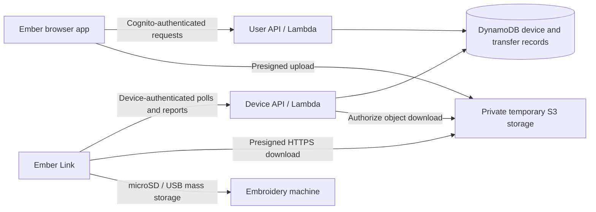

# Ember Link cloud transfer: backend architecture overview

> Planning context. The current firmware implementation focuses on cloud transfer
> only and uses new Ember Link identifiers without legacy compatibility. The
> executable v1 contract is documented in [cloud-protocol.md](cloud-protocol.md);
> claiming, browser setup, and remote file management remain future work.

Status: proposed architecture for developer review; not implemented.

Prepared September 20, 2026. This proposal is based on the current EmberConnect,
EmberBridge, and Desktop/ember-app source. Resource names, routes, and timing
values below are proposals, not existing contracts or deployment commitments.

Product naming: the dongle is now **Ember Link**. `EmberConnect` remains the
current repository name and appears in existing firmware/protocol identifiers.
This planning snapshot originally preserved those identifiers. The new
`ember-link` firmware intentionally uses new identifiers; legacy compatibility
is no longer a requirement. The proposed setup URL remains
`connect.emberdesign.net`.

## Product outcome and initial scope

A customer configures an Ember Link dongle through the Ember website, links it
to their Ember account, and plugs it into their embroidery machine. They can
then send an exported embroidery design from Ember without installing Ember
Bridge. The dongle makes the design visible to the machine as a USB-drive file.

For the first beta:

- One owner account per dongle; an account may own multiple dongles.
- Browser USB setup, WiFi provisioning, and explicit account linking.
- Send to a recently online dongle; one active transfer per dongle.
- Progress, completion, actionable failures, and explicit retry.
- Retain the existing local Bridge transport and USB setup protocol.
- Cloud is enabled by explicit account linking and can be disabled.

Deferred: shared ownership, long-lived offline queues, automatic transport
failover, cloud firmware rollouts, and remote control of embroidery operations.
The existing WiFi-hotspot setup remains useful; adding account claiming to that
fallback is a separate onboarding increment.

**Success means the dongle verified and stored the file and completed the USB
reconnect procedure. It does not mean the machine opened the design or stitched
it.** There is no machine-side acknowledgement through the current USB interface.

## Existing components we can reuse

In ember-app:

- `template.yaml`: AWS SAM, API Gateway, Lambda, DynamoDB, and S3 resources.
- Cognito-authenticated browser APIs and existing account identity.
- `backend/get-save-urls/`: direct-to-S3 upload patterns.
- `packages/async-jobs/`: useful examples of conditional job transitions,
  polling, ownership checks, and structured errors.
- `frontend/src/components/editor-modals/SendToMachinePanel.tsx` and
  `frontend/src/lib/emberBridge/`: existing design-send UI and local transport.

In the EmberConnect repository (Ember Link firmware):

- `firmware/main/storage.c`: SD ownership and USB reconnect behavior.
- `firmware/main/http_api.c`: streamed file upload and filename validation.
- `firmware/main/usb_setup.h`: WiFi scan/provisioning, naming, and signed updates.
- Existing WiFi reconnect logic and signed firmware update support.

The generation-job package is coupled to generation entitlements, artifacts,
and history. Reuse general patterns or extract helpers; do not put device
transfers into generation quotas or permanent generation artifact storage.

## Recommended first architecture

Use authenticated HTTPS polling for commands/status and private S3 storage for
design bytes. Every dongle connection is outbound; no inbound LAN access or
router configuration is required.



Use the existing API Gateway/Lambda deployment model. User and device routes
can share a gateway, but have distinct authentication policies and handler
permissions. No persistent relay process, MQTT broker, or WebSocket connection
is required for the beta.

S3 presigned URLs support temporary uploads/downloads; they are reusable until
expiry, not single-use credentials. See [AWS presigned URL documentation](https://docs.aws.amazon.com/AmazonS3/latest/userguide/using-presigned-url.html).

Keep delivery transport behind a small interface. Later, MQTT or WebSocket
notifications could announce jobs while preserving S3 downloads and the same
job state machine.

## Identity, authentication, and claiming

### Browser identity

Use the existing Cognito session. Resolve the owner from the verified token's
`sub`; never trust a user ID from a request body as authorization. Check current
ownership on every device and transfer operation.

### Device identity

Give each physical dongle a stable device ID and a unique random 256-bit cloud
credential provisioned during factory QA. Store a verifier/hash in a restricted
backend credential record; store the credential on the device outside the
firmware image. A public serial number is an identifier, not a secret.

For a small beta, a per-device bearer credential over verified TLS is a simple
option. Authenticate it on every device request against an active credential
record, resolving the device ID server-side. Do not place credentials in URLs.
Avoid authorizer caching initially, so revocation is effective on subsequent
requests. Define credential replacement/recovery before shipping.

Keep cloud device identity separate from Cognito tokens, local Bridge pairing
tokens, and the firmware signing key. Cloud credentials must not be returned to
the browser during setup. The board currently lacks flash encryption; this
design does not promise resistance to credential extraction by someone with
physical access. Per-device revocation limits the scope of a compromised unit.

### Proposed USB claim flow

1. User signs into Ember and authorizes its Web Serial device connection.
2. Browser provisions WiFi using the existing USB protocol.
3. A new USB command asks the dongle to begin cloud claiming. The dongle uses
   its device credential to request a short-lived, single-use claim challenge
   from the backend and returns the claim token through USB.
4. Browser submits that token to the user-authenticated claim endpoint.
5. Backend atomically consumes the challenge and assigns the unowned device to
   the authenticated user. A competing or expired claim fails.
6. Dongle confirms its claimed status on its next poll; the website waits for
   cloud readiness before reporting setup complete.

Store only a hash of the high-entropy claim token; bind it to the authenticated
device and an explicit expiry, provisionally five minutes. A claim endpoint on
the dongle must require a physical setup action, not be callable freely over
the LAN. Existing ownership cannot be overwritten merely by possessing USB.

Unclaiming increments an ownership generation, revokes pending claims, and
invalidates undelivered jobs. Each job is bound to its original owner and
ownership generation. Factory reset clears local configuration and cloud
enablement, but should not silently make a server-owned device claimable by
someone else. Resale uses owner unclaim plus physical setup; lost-account
recovery needs an explicit support policy.

Revocation cannot retract bytes already downloaded or guarantee removal of a
file already on the card. The UI and support policy must reflect that boundary.

## Transfer lifecycle

1. **Create:** browser exports machine-ready bytes, computes size and SHA-256,
   and requests a transfer for an owned, recently online device. Backend checks
   limits and atomically reserves the device's active-transfer slot. An
   idempotency key makes repeated create requests return the same job; reuse
   with different parameters is rejected.
2. **Upload:** backend returns a short-lived S3 upload authorization for a
   server-generated object key. Browser uploads bytes directly to S3. Bind the
   checksum to the signed upload and enforce a maximum size; validate actual
   object size/checksum before making the job deliverable.
3. **Finalize:** browser calls the finalize endpoint. Backend verifies the
   object, rechecks ownership, online freshness and expiry, then moves the job
   to `ready`. Finalize is idempotent. If the device has gone offline, fail the
   send instead of creating a long-lived offline delivery.
4. **Acquire:** a device poll atomically acquires its ready job. Backend issues
   an attempt ID, lease, expected filename/size/hash, and short-lived download
   URL. Duplicate polls return the same active attempt rather than creating
   additional execution.
5. **Download:** firmware streams bytes to a temporary file with bounded RAM,
   verifies length and SHA-256, then installs the file and reconnects USB using
   the shared storage code. Local uploads and cloud downloads must serialize
   through the same storage ownership mechanism.
6. **Acknowledge:** firmware reports a durable receipt containing job/attempt
   ID, hash, stored filename, and completion. Backend conditionally records
   `done` and releases the active slot. Duplicate completion reports are safe.
7. **Display/cleanup:** browser polls job status. File objects are removed after
   a short retention window; job metadata can remain longer for support.

Pin the validated S3 object version for downloads, so a still-valid upload URL
cannot replace the payload after finalize. A versioned temporary bucket must
also expire noncurrent versions. See [S3 GetObject version selection](https://docs.aws.amazon.com/AmazonS3/latest/API/API_GetObject.html).

### State and failure semantics

```text
awaiting_upload -> ready -> delivering -> done

Before acquisition: canceled, expired, or failed
During delivery: failed (known outcome) or needs_reconciliation (unknown outcome)
After reconciliation: done or failed
```

`needs_reconciliation` means delivery may have completed but confirmation was
lost. A device timeout is not proof of failure. Do not automatically reassign
an ambiguous transfer or clear its slot solely because a lease expired.

Use monotonic report sequence numbers and attempt IDs to reject stale progress.
Check owner generation and lease validity when renewing access. Cancel is
supported before acquisition; cancellation after acquisition is best-effort
and cannot promise that the file will not appear.

The firmware needs a small durable transfer journal and a recoverable file
replacement procedure. On restart it reconciles staged/installed content and
replays receipts before accepting another job. The existing HTTP handler's
temporary-file/rename sequence alone does not establish these guarantees.
Specify recovery for power loss during replacement and USB reconnect; an
additional reconnect can be necessary after a crash. Do not claim exactly-once
physical USB effects.

A bounded retry of a known-incomplete download can occur within one attempt.
After terminal failure, the user starts a new transfer. An ambiguous attempt
requires reconciliation or an explicit recovery action before another send.

## Suggested API surface

Routes are illustrative. Use versioned contracts and existing API conventions.

| Caller | Route | Purpose |
|---|---|---|
| User | `GET /v1/connect/devices` | List owned devices and last-seen status |
| User | `POST /v1/connect/claims/redeem` | Consume claim token and establish ownership |
| User | `PATCH /v1/connect/devices/{id}` | Update display name |
| User | `POST /v1/connect/devices/{id}/unclaim` | Remove ownership and invalidate future delivery |
| User | `POST /v1/connect/devices/{id}/transfers` | Reserve slot and obtain upload authorization |
| User | `POST /v1/connect/transfers/{id}/finalize` | Validate uploaded object and make ready |
| User | `GET /v1/connect/transfers/{id}` | Progress, outcome, or reconciliation status |
| User | `POST /v1/connect/transfers/{id}/cancel` | Cancel a transfer not yet acquired |
| Device | `POST /v1/device/claims` | Begin a physically initiated claim |
| Device | `POST /v1/device/poll` | Heartbeat, reconcile receipts, acquire/renew one job |
| Device | `POST /v1/device/transfers/{id}/events` | Ordered progress, failure, or completion report |

Device identity comes from authentication, not an arbitrary device ID supplied
in the request. Device routes cannot list other devices or retrieve user
account tokens. Poll responses include protocol version, server time, next poll
delay, ownership generation, and any active attempt. Use a common structured
error envelope such as `{ "error": { "code": "device_busy", "message": "..." } }`.

Core error codes: `unauthorized`, `device_unclaimed`, `device_offline`,
`device_busy`, `claim_expired`, `already_claimed`, `file_too_large`,
`invalid_filename`, `insufficient_storage`, `checksum_mismatch`,
`download_failed`, `storage_failed`, `transfer_expired`, `rate_limited`,
`firmware_update_required`, and `needs_reconciliation`.

## Data model and AWS resources

Logical records can use separate tables or an intentional single-table design.

| Record | Important fields / access pattern |
|---|---|
| Device | ID, serial, owner ID, ownership generation, nickname, firmware/capabilities, last seen, storage summary, active transfer ID; list by owner |
| Credential | Device ID, credential ID/hash, active/revoked state; restricted authentication lookup |
| Claim | Token hash, device ID, expiry, consumed state; direct token lookup |
| Transfer | Job ID, owner/device/generation, status, filename, size/hash, object key/version, attempt/lease, progress sequence, receipt/error, timestamps |
| Idempotency | Owner, operation/key, request fingerprint, job ID, expiry |

Use conditional writes/transactions for ownership changes, claim redemption,
slot reservation, and state transitions. Index owner/device history as needed;
use the device's direct active-job pointer for dispatch rather than table scans
or an eventually consistent index as the source of assignment authority.
[DynamoDB transactions](https://docs.aws.amazon.com/amazondynamodb/latest/developerguide/transactions.html)
support coordinated changes across records.

Proposed infrastructure: user/device Lambda handlers and authorization, device
and transfer tables, a private versioned transfer bucket, CloudWatch metrics
and alarms, and a scheduled reconciliation/cleanup Lambda if needed. Express
resources in SAM with isolated development and production environments.

Provisional retention: claim validity five minutes; upload/ready deadline five
minutes; transfer file retention 24 hours; job metadata retention 30 days.
Lease/progress timeout must accommodate supported file sizes and measured SD
throughput. These are independent settings, not one shared expiry value.

Enforce business expiry in application conditions. DynamoDB TTL and S3 lifecycle
are cleanup mechanisms, not precise expiry timers. AWS notes that DynamoDB TTL
deletion can occur days after expiry. [DynamoDB TTL](https://docs.aws.amazon.com/amazondynamodb/latest/developerguide/TTL.html)

## Polling, presence, and operating cost

Start by evaluating a 10-second idle poll with jitter, a 30-second recent-online
threshold, and progress reporting every 2–5 seconds during a transfer. The
server can return revised polling intervals. Use exponential backoff for
network failures and honor throttling responses; do not continuously retry a
revoked credential.

At 10 seconds, one continuously powered device makes 8,640 polls/day; 1,000
devices make 8.64 million. Model gateway, Lambda, authentication reads, presence
writes, logs, storage, and bandwidth before approving the production cadence.
Do not log every empty poll by default. Persist presence at a controlled cadence
and define the online threshold consistently with that cadence.

Report last-seen timestamps honestly: polling provides recent reachability,
not proof the dongle is connected at the instant a user clicks Send. Display
offline devices normally; many will simply be plugged into powered-off machines.

## Security, privacy, and open-source boundaries

- TLS with hostname/certificate verification for all cloud traffic; firmware
  needs a trusted certificate bundle, time synchronization, and failure handling.
- Private bucket, narrow presigns, server-controlled keys, upload limits,
  checksum verification, account/device authorization, and rate limits.
- Restrict firmware downloads of design bytes to approved HTTPS storage hosts;
  do not expose an arbitrary URL-fetch command or follow unvalidated redirects.
- Unclaim/revocation stops subsequent authorization. Already-issued presigned
  URLs can remain usable until expiry; use short lifetimes and document this.
- Logs contain IDs, stages, byte counts, timings, and error codes; exclude
  credentials, signed URLs, WiFi passwords, design contents, and claim tokens.
- Keep signing keys, factory device credentials, deployment secrets, and
  recipient records out of source control. Public firmware contains no shared
  production secret.
- Document how community firmware/self-hosted deployments enroll with their own
  backend. Access to Ember's hosted service is an explicit enrollment policy,
  not an implicit consequence of knowing a serial number.

## Responsibilities and delivery sequence

**Cloud developer:** SAM resources, user/device authentication, enrollment and
claiming, job state machine, S3 authorizations, receipt reconciliation, metrics,
limits, retention, and backend tests.

**Firmware developer:** TLS/time initialization, device credential storage,
claim command, polling/download client, shared file-transfer primitive,
durable receipts, storage arbitration, reconnect/backoff, and protocol versioning.

**Web developer:** `connect.emberdesign.net` setup experience and account session,
Web Serial transport, export/hash/upload, cloud device selection, progress,
ownership management, and integration with the existing send interface. Give
devices stable identities rather than using local IP addresses as cloud keys.

Suggested sequence:

1. Hardware feasibility: a real dongle downloads a private HTTPS object within
   the available RAM, verifies it, and exposes it to a physical machine.
2. Authenticated vertical slice: one enrolled device, one owner, upload,
   transfer, and acknowledged result in Ember.
3. Browser setup and secure claim/unclaim, with version/capability negotiation.
4. Failure recovery, manufacturing enrollment, operating-cost measurements, and
   a small physical-device beta.

Before beta, test cross-account access, simultaneous claims/sends, stale owner
generation, expired upload URLs, overwritten upload objects, checksum mismatch,
full card, concurrent LAN upload, router outage, credential revocation, and
power loss at each file-commit stage. Lost completion acknowledgements must
reconcile without blindly delivering again. Confirm that a computer/browser
can disconnect after finalize without interrupting device delivery.

## Decisions requested from the cloud developer

1. Is polling economical for the expected powered-on fleet and acceptable
   delivery latency, or should push signaling be part of the first release?
2. Confirm device credential enrollment/rotation and existing-unit migration.
3. Confirm DynamoDB access patterns, transaction boundaries, and recovery rules.
4. Agree API schemas, protocol versioning, file limits, polling/lease deadlines,
   and receipt semantics with the firmware developer before implementation.
5. Confirm claim/unclaim/reset/resale policy and account session handling on
   the setup subdomain.
6. Confirm file retention, cloud entitlements, expected operating budget, and
   operational ownership before public availability.
